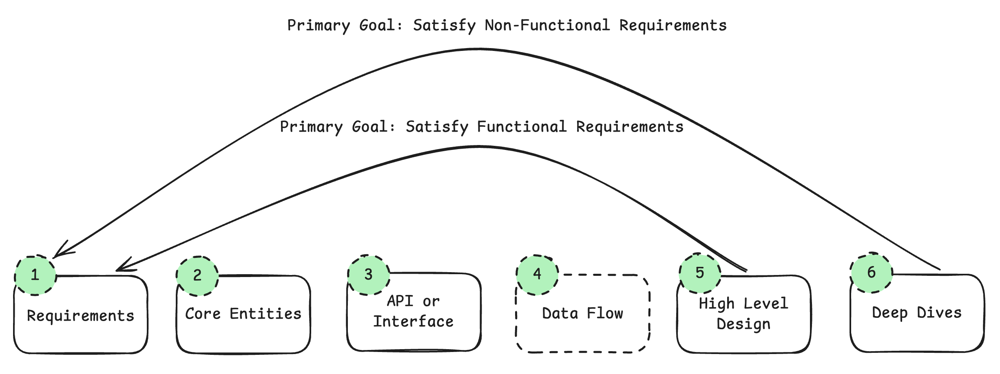
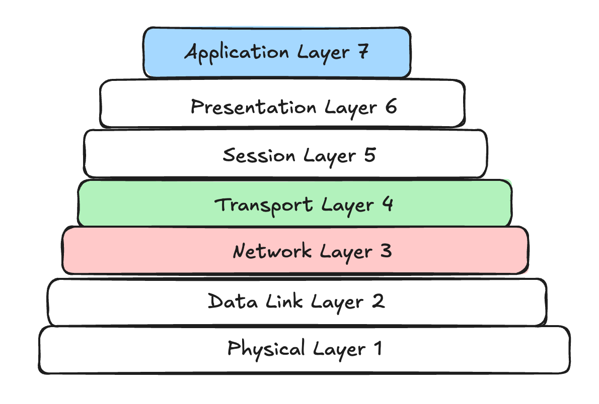
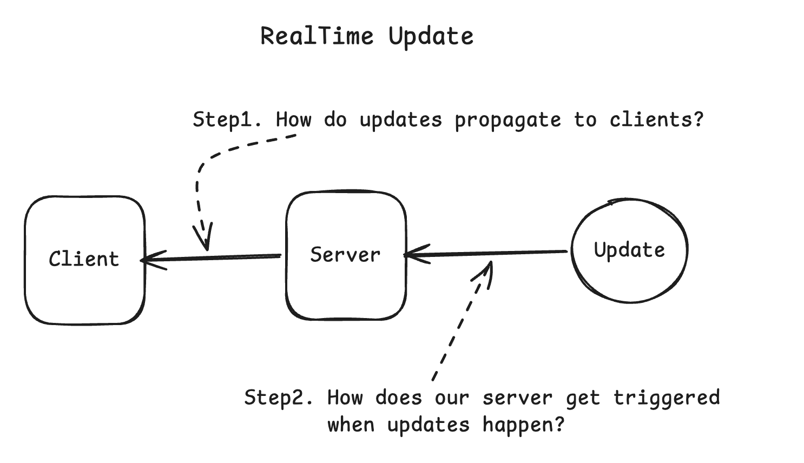
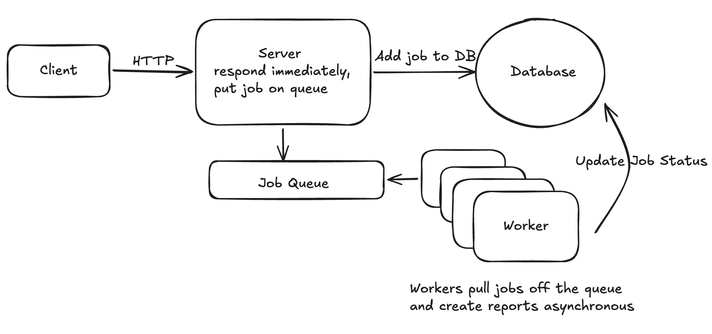
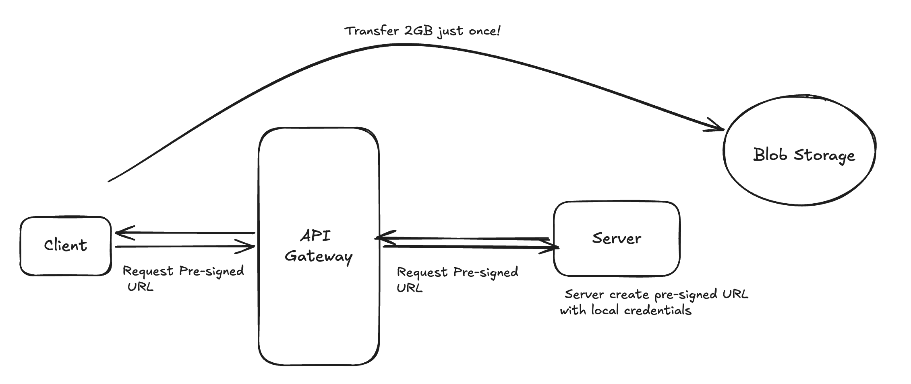
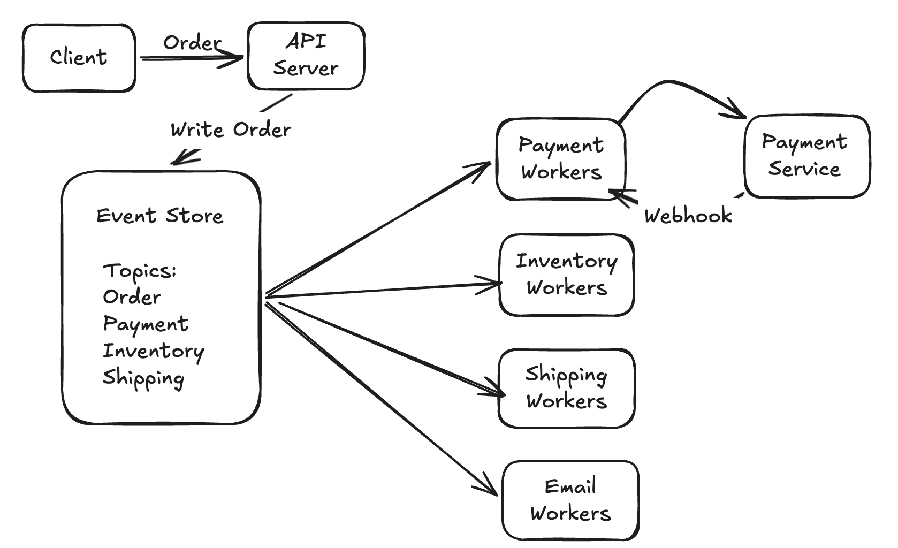

# System Design - In a Hurry（中文重译）

原文：<https://www.notion.so/System-Design-In-a-Hurry-3183c5ca79eb8022ae5bea83328c2204?source=copy_link>

> 说明：图片已替换为 Notion 导出包中的本地 PNG 资源，避免远程签名链接过期。

## 如何准备系统设计面试

### 1. 打好基础（Build a Foundation）
1. 先理解系统设计面试到底在考什么。
2. 选择一个稳定的答题交付框架（delivery framework）。
3. 从基础内容开始。

建议先读系统设计里的核心概念、关键技术和常见模式。这些内容通常是高层抽象，但能帮你建立后续推演所需的心智模型。

### 2. 反复练习（Practice Practice Practice）
基础建立后，重点是练。被动阅读有价值，但亲自做题的信息留存会更高。

1. 选一道题。
2. 阅读需求。
3. 先独立作答。
4. 对照参考答案。
5. 再做一次验证和复盘。

## 交付框架（Delivery Framework）

交付框架的目标是：让你结构化表达，并把时间放在最关键的部分。

系统设计面试里，最常见失败点之一是最后没交付出一个可工作的方案。中级候选人常被说“时间管理不好”，但很多时候不是速度不够，而是没有优先做对关键决策。

我们推荐按固定步骤与时间配比推进。这样你可以持续聚焦面试官关注点，在压力下也有清晰回退路径。

下面是框架图：



### 3. 需求（~5分钟）
目标：对要设计的系统有清晰定义。

#### 功能需求（Functional Requirements）
需求要聚焦。后续设计是围绕你确认过的需求展开的，因此优先级必须有策略。

#### 非功能需求（Non-functional Requirements）
如果你不熟悉业务域，可以从以下清单切入：
1. CAP 取舍：一致性还是可用性优先（分区容忍在分布式里默认要考虑）。
2. 环境约束：移动端、低带宽、低内存等条件。
3. 可扩展性：是否有突发流量、固定时段高峰。
4. 延迟：接口响应时间目标，尤其是重计算链路。
5. 持久性：可否容忍数据丢失。
6. 安全：数据保护、访问控制、合规。
7. 容错：故障时的冗余、切换、恢复能力。
8. 合规：行业监管、法律约束。

#### 容量估算（Capacity Estimation）
建议不要一开始就做大段估算。可以先说明：在遇到关键架构决策时再估算。

例如设计社交平台热门 TopK，如果你要决定是否单机最小堆足够，还是必须分片到多实例，必须先估算话题规模。

### 4. 核心实体（~2分钟）
先列核心实体（Core Entities），用于统一术语、锚定关键数据、搭建设计骨架。

不要在一开始就写完整数据模型。随着设计推进，你会发现更多实体和关系。

### 5. API / 系统接口（~5分钟）
常见风格：REST / GraphQL / RPC。

REST 里资源建议使用复数名词。例如：

```http
POST /v1/tweets
body: { "text": string }

GET /v1/tweets/{tweetId} -> Tweet

POST /v1/follows
body: { "followee_id": string }

GET /v1/feed -> Tweet[]
```

### 6. 数据流（~5分钟）
对于数据处理类系统，建议描述高层处理链路：输入 -> 处理步骤 -> 输出。

### 7. 高层设计（~10-15分钟）
画方框和箭头，描述组件及交互（服务、数据库、缓存等）。

核心目标：先交付满足 API 与需求的可工作架构。不要过早堆复杂度。

### 8. 深入讨论（Deep Dives，~10分钟）
通过以下方式加固方案：
- 覆盖并满足所有非功能需求
- 处理边界场景
- 识别并解决瓶颈
- 根据面试官追问迭代优化

资历越高，越应该主动主导 deep dive。

---

## 核心概念（Core Concepts）

核心概念是系统设计面试中的通用底层能力。它不依赖具体技术栈，几乎每道题都会出现。

### 网络基础（Networking Essentials）
你需要掌握服务间通信和连接故障处理的实战要点。

默认多数系统选择 HTTP over TCP。除非有明确理由，否则这是最稳妥默认。

网络相关图：



#### WebSocket vs SSE
- SSE 是单向推送，适合通知、比分等。
- WebSocket 是双向通信，适合聊天、协同编辑。

两者都是有状态连接，需考虑连接保持与节点故障时的连接迁移。

#### gRPC
适合内部服务高性能通信（HTTP/2 + 二进制序列化），但不常用于浏览器公网 API。

#### 负载均衡
- L7：可按 HTTP 内容路由，灵活。
- L4：按 TCP 分发，更快但能力更基础。

### API 设计
- 大列表要分页。
- 实时数据更适合游标分页（cursor），普通场景 offset 也可。
- 用户会话可用 JWT，服务间可用 API Key。
- 容易被滥用的接口需要限流。

### 数据建模
SQL 与 NoSQL 的取舍是高频题。

### 数据库索引
索引是提升查询性能的核心手段。

### 缓存
当数据库读压力过高时，缓存是首选读扩展方案。

难点不在“加缓存”，而在“缓存失效策略（invalidation）”。

### 分片（Sharding）
当单库达到存储、写吞吐、读吞吐瓶颈时，需要水平拆分。

最关键决策：分片键（shard key）。

分片会带来跨分片事务、热点分片、重分片成本等新问题。

### 一致性哈希（Consistent Hashing）
使用虚拟环，节点变动时仅影响局部数据迁移。

### CAP
常见取舍是 CP 或 AP。

### 关键数量级（Numbers to Know）
架构决策离不开量级判断。例如：要不要分片、单 Redis 能否扛住。

经验量级：
- 优化良好的数据库可达到较高 QPS/TPS。
- 单 Redis 实例可达到十万级操作吞吐。

更重要的是延迟层级差：
- 内存：纳秒级
- SSD：微秒级
- 同机房网络：毫秒级
- 跨洲网络：几十到几百毫秒

这些差异会直接影响缓存、跨地域部署和一致性策略。

原文表格（翻译）：

| 组件 | 关键指标 | 扩展触发 |
|---|---|---|
| 缓存 | ~1ms 延迟；100k+ ops/s；内存上限约 1TB | 命中率 < 80%；延迟 > 1ms；内存 > 80%；缓存抖动 |
| 数据库 | 最高约 50k TPS；缓存命中读延迟 < 5ms；存储可达 64TiB+ | 写吞吐 > 10k TPS；未命中读延迟 > 5ms；需要跨地域 |
| 应用服务器 | 100k+ 并发连接；8-64 核；64-512GB RAM（可到 2TB） | CPU > 70%；响应超 SLA；连接逼近上限；内存 > 80% |
| 消息队列 | 单 broker 最高约 1M msg/s；端到端延迟 < 5ms；50TB 存储 | 吞吐逼近 800k msg/s；分区逼近集群上限；消费积压增长 |

---

## 关键技术（Key Technologies）

这一部分覆盖可解决 90% 系统设计题的技术类别。

### 核心数据库（Core Database）
几乎所有系统设计题都需要持久化数据。常见选择是关系型数据库和 NoSQL。

注意：面试里不建议机械对比“SQL vs NoSQL”。泛化结论往往暴露经验不足。多数情况下，你不需要专门做显式对比，除非问题场景确实要求。

### 关系型数据库（Relational Databases）
你需要熟悉：
- SQL Join
- Index
- 事务

### NoSQL 数据库
适用场景：
- 灵活数据模型
- 水平扩展
- 大数据与实时应用

你需要掌握：
- 数据模型
- 一致性模型
- 索引
- 扩展方式

### Blob 存储
大文件（图片、视频、二进制文件）不应放传统数据库。成本高且效率差。

常见场景：YouTube、Instagram、Dropbox 类设计。

应掌握：
- 高持久性（复制、纠删码）
- 高扩展性（如 S3）
- 成本优势
- 安全能力（静态/传输加密、访问控制）
- 客户端直传直下载
- 分片上传（chunking）

### 搜索优化数据库（Search Optimized Database）
做全文检索时常用。

应掌握：
- 倒排索引（Inverted Index）
- 分词（Tokenization）
- 词干提取（Stemming）
- 模糊搜索（Fuzzy Search）
- 集群扩展与分片

### API Gateway
面试通常不会深挖网关实现细节，除非与题目本身高度相关。

### Load Balancer
高流量场景下用于分发请求、避免单点过载。

### Queue
队列常用于：
1. 削峰缓冲
2. 工作分发

应掌握：
- 消息顺序（多数 FIFO）
- 重试机制
- 死信队列（DLQ）
- 分区扩展
- 背压（Backpressure）

注意：强同步低延迟（如 <500ms）链路里，盲目加队列常会破坏延迟目标。

### Streams / Event Sourcing
事件溯源是把状态变化记录为事件序列，可重放恢复任意时刻状态。

相比队列，流（stream）可以保留数据并支持重复消费，适合：
1. 实时大规模处理
2. 复杂事件处理（含 event sourcing）
3. 多消费组并发消费

应掌握：
- 分区扩展
- 多消费组
- 复制
- 窗口计算（windowing）

### 分布式锁（Distributed Lock）
当跨进程/跨服务争抢同一资源时使用。常见实现依赖 Redis/ZooKeeper。

应掌握：
- 获取/释放机制（如 Redlock）
- 过期机制（避免死锁）
- 锁粒度
- 死锁风险

### 分布式缓存（Distributed Cache）
用于降低延迟和读扩展。

应掌握：
- 淘汰策略：LRU/FIFO/LFU
- 缓存失效策略
- 写入策略：Write-Through / Write-Around / Write-Back

### CDN
CDN 通过全球边缘节点加速内容分发，不只可缓存静态资源，也可缓存 API 响应。

---

## 常见模式（Common Patterns）

模式识别能力是区分资深与初级候选人的关键能力之一。掌握模式能帮你快速识别重点与常见故障路径。

### 1) 实时更新推送（Pushing Realtime Updates）
协议可选：轮询、SSE、WebSocket。

服务端可用 Pub/Sub 解耦发布与订阅；更重处理场景可用一致性哈希环上的有状态服务。



### 2) 长任务处理（Managing Long-Running Tasks）
对视频转码、报表生成等长耗时任务，采用“快速确认 + 异步执行”模式：
- API 快速校验并入队，立即返回 Job ID
- Worker 后台消费执行

优势：
- 用户响应快
- Web 与 Worker 可独立扩容
- 故障隔离更好



### 3) 处理资源竞争（Dealing with Contention）
多人同时抢同一资源（如最后一张票）时，需要防竞态和保一致。

方案从单库层（悲观锁、乐观并发控制）到分布式层（分布式锁、2PC、队列串行化）逐步增强。

### 4) 读扩展（Scaling Reads）
用户量增长后，读通常先成为瓶颈。

常见路径：
1. 先优化数据库（索引、必要反范式）
2. 用只读副本水平扩展
3. 加外部缓存（Redis）和 CDN

关键问题：缓存失效、副本延迟、热点 key。

### 5) 写扩展（Scaling Writes）
通过分片、批处理、负载治理应对写瓶颈。

关键点：
- 选择好的分区键（均衡负载并尽量保持相关数据邻近）
- 用队列吸收写突发
- 过载时负载丢弃（load shedding）
- 批写降低单次操作开销

### 6) 大文件处理（Handling Large Blobs）
应用服务签发临时凭证（presigned URL），客户端直传对象存储；下载通过 CDN + 签名 URL 控制权限。

这样可以避免应用服务器成为瓶颈，并支持断点续传、上传进度和全球分发。



### 7) 多步骤流程（Multi-Step Processes）
复杂业务流程涉及多服务、长链路和重试容错（如下单、开户、支付）。

方案从单服务编排到工作流引擎（Temporal、AWS Step Functions）逐步升级。

关键思想：把分散的状态管理和手工错误处理，转成声明式工作流，让系统保障执行语义并保留完整审计轨迹。



### 8) 基于地理位置的服务（Proximity-Based Services）
如打车、即时配送等，需要按地理邻近搜索实体。常用方案：
- PostgreSQL + PostGIS
- Redis GEO
- Elasticsearch Geo Query

### 9) 模式选择（Pattern Selection）
模式常需组合使用。例如视频平台可能同时用到：
- Large Blobs（上传存储）
- Long-Running Tasks（转码）
- Realtime Updates（进度通知）
- Multi-Step Processes（流程编排）

策略：先简单方案（轮询、单服务编排），只有在明确需求驱动下再引入复杂度。

在面试中，主动识别并套用这些模式，能体现架构成熟度，也能避免陷入实现细节泥潭。
